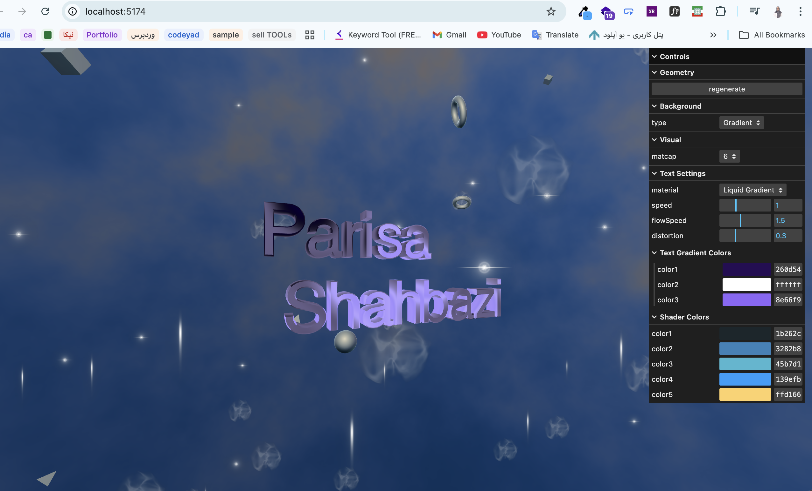

# Three.js Text Particle Effect

## 🌐 [Live Demo](https://3dtext-shader.parisashahbazi.com/)



An interactive 3D visualization built with **Three.js** featuring animated text, dynamic particles, diverse rotating geometries, and a customizable gradient background shader.

## ✨ Features

- **Animated Text**: 3D text ("Parisa Shahbazi") with beveled edges and particle effects
- **Dynamic Particles**: 150 particles with two animation types:
  - **Bobbing Motion**: Smooth floating/drifting movement (vertical + side-to-side)
  - **Pulsing Scale**: Rhythmic grow/shrink effect for a breathing appearance
  - Each particle has random speeds and phase offsets for natural variation
- **Rotating Geometries**: 50 diverse 3D shapes with multiple types:
  - **OctahedronGeometry** - 8-sided polyhedron
  - **ConeGeometry** - Pointed cone shape
  - **DodecahedronGeometry** - 12-faced shape
  - **IcosahedronGeometry** - 20-faced complex sphere
  - **TorusGeometry** - Ring/donut shape
  - **TorusKnotGeometry** - Twisted knot shape
  - 40% transparency (60% opacity) for ethereal effect
  - Multiple size variations for visual diversity
  - Smooth orbital movement patterns
  - Independent rotation speeds on all axes
- **Smooth Camera Orbit**: 
  - Continuous orbital camera movement around the text
  - Gentle vertical bobbing for dynamic 3D perspective
  - Stops on user interaction (mouse drag/zoom)
  - Resumes automatically when idle
- **Interactive Controls**:
  - Mouse drag to manually rotate camera
  - Scroll/Pinch to zoom in/out (limited to max 15 units)
  - Auto-rotate after 3 seconds of inactivity
- **Customizable Gradient Background**:
  - Advanced 3D noise-based shader with 5 customizable colors
  - Smooth color transitions using Gaussian distribution
  - Real-time color adjustments via GUI
- **Material Options**:
  - Gradient Shader (default with animated background)
  - Matcap material with 14 texture options
- **Performance Optimized**: Uses matcap materials for realistic lighting without heavy computation

## 🚀 Getting Started

### Prerequisites
- [Node.js](https://nodejs.org/en/download/) (v14 or higher)
- npm (comes with Node.js)

### Installation & Running

```bash
# Install dependencies (only needed once)
npm install

# Start development server at http://localhost:8080
npm run dev

# Build for production to dist/ directory
npm run build
```

## 🎮 Controls

### Mouse & Interaction
- **Scroll/Pinch**: Zoom in/out (limited to max distance of 15 units)
- **Drag**: Manually rotate the camera (disables auto-orbit while interacting)
- **Release**: Camera resumes smooth orbital motion after 3 seconds of inactivity

### GUI Controls

Access the control panel in the top-left corner:

#### Geometry
- **Regenerate**: Create new random 3D shapes (mix of 6 different geometry types) at random positions with new animations

#### Background
- **Type**: Switch between "Gradient" and "Matcap" backgrounds

#### Shader Colors (Gradient only)
- **Color 1-5**: Customize the 5 colors in the animated gradient
  - Uses Gaussian distribution for smooth color blending
  - Changes apply in real-time

#### Visual
- **Matcap**: Select from 14 different matcap textures for text and geometry materials

#### Text Settings
- **Material**: Switch between "Matcap" and "Liquid Gradient" text rendering
- **Speed** (Liquid Gradient only): Control animation speed (0.1 - 3.0)
- **Flow Speed**: Control liquid flow rate (0.5 - 3.0)
- **Distortion**: Control liquid surface distortion (0.0 - 1.0)
- **Text Gradient Colors**: Customize the 3 colors for liquid gradient effect

## 🏗️ Project Structure

```
threejs-text-particle-effect/
├── src/
│   ├── script.js          # Main application code
│   ├── style.css          # Styling
│   └── index.html         # HTML entry point
├── static/                # Static assets
│   ├── textures/
│   │   ├── matcaps/       # 14 matcap textures
│   │   └── particle/      # Particle textures (star, flare)
│   └── fonts/             # Helvetiker font
├── assets/                # Preview images
├── package.json           # Dependencies and scripts
└── readme.md              # This file
```

## 🎨 Shader Architecture

### Background Shader
- **Type**: Custom GLSL shader with advanced 3D noise
- **Features**:
  - Perlin-like noise function
  - Fractional Brownian Motion (FBM) for complex patterns
  - 3D position-based animation with multiple movement layers
  - 5-color gradient with Gaussian blending
  - Continuous movement and pulsing effects
  - Dynamic lighting based on surface normals

### Text Shader (Liquid Gradient)
- **Type**: Custom GLSL shader for liquid paint effect
- **Features**:
  - Directional liquid flows (horizontal, vertical, diagonal)
  - Wavy distortion for liquid surface effect
  - 3D noise-based liquid patterns
  - Ripple animations
  - Smooth color transitions with shimmer/sparkle
  - Saturation boost for vibrant appearance

### Material Types
- **MeshMatcapMaterial**: Fast, realistic lighting using pre-rendered matcap textures
- **ShaderMaterial**: Custom gradient with time-based animation
- **SpriteMaterial**: For particle rendering with custom textures

## 🔧 Key Components

### Scene Elements
1. **Text Geometry**: 3D beveled text ("Parisa Shahbazi") with:
   - Customizable material (Matcap or Liquid Gradient)
   - Slow rotation around Y-axis
   - Centered in viewport

2. **Animated Geometries**: 50 mixed 3D objects with:
   - 6 different geometry types (Octahedron, Cone, Dodecahedron, Icosahedron, Torus, TorusKnot)
   - Multiple size and detail variations for each type
   - 40% transparency for layered effect
   - Orbital movement with sine/cosine waves
   - Independent rotation on X, Y, Z axes
   - Random positioning within 35-unit spread

3. **Particles**: 150 animated sprites with:
   - Bobbing motion: smooth vertical + diagonal floating
   - Pulsing scale: rhythmic growth/shrinkage
   - Random textures (star, flare)
   - Spread across 25-unit radius around text
   - Variable speeds and phase offsets

4. **Background Sphere**: 200-unit radius with:
   - Custom gradient shader
   - OR matcap material option
   - Switchable in GUI

### Animation System
- **Camera Orbit**: Uses time-based sin/cos calculations for smooth circular motion
- **Geometry Movement**: Sine/cosine waves with random amplitudes and speeds
- **Particle Animation**: Two distinct animation types applied randomly
- **Real-time Shader**: Time uniform updates for all shaders (60 FPS)
- **Idle Detection**: Automatic camera auto-rotation after 3 seconds

## 🎯 Performance Tips

- The scene supports up to 500 particles and 50+ animated geometries
- Uses optimized matcap materials instead of complex lighting
- GPU-based shader animations for smooth performance
- Respects device pixel ratio for retina displays
- OrbitControls with damping for smooth interactions

## 📝 Customization

### Change Text
Edit line ~695 in `script.js`:
```javascript
const textGeometry = new TextGeometry(
    'Your Text Here',  // Replace with your text
    {
        font: font,
        size: 0.5,
        depth: 0.2,
        // ... other properties
    }
)
```

### Adjust Particle Count
Modify the `particleConfig` object (line ~510):
```javascript
const particleConfig = {
    count: 150,      // Number of particles (change this)
    size: 0.04,      // Particle size
    spread: 25       // Spread radius
}
```

### Modify Geometry Count
Change the loop count (line ~679):
```javascript
for (let i = 0; i < 50; i++) {  // Change 50 to your desired count
    createRandomGeometry()
}
```

### Add or Change Geometry Types
Edit the geometries array (line ~644):
```javascript
const geometries = [
    new THREE.OctahedronGeometry(0.2, 0),
    new THREE.ConeGeometry(0.25, 0.5, 32),
    // Add or replace geometry types here
]
```

### Adjust Camera Orbit Speed
Modify line ~1083 in `script.js`:
```javascript
controls.autoRotateSpeed = 0.2  // Increase for faster orbit
```

### Change Transparency Level
Edit line ~657 in `script.js`:
```javascript
const material = new THREE.MeshMatcapMaterial({
    matcap: matcapTexture,
    transparent: true,
    opacity: 0.6  // 0.6 = 40% transparent, adjust as needed
})
```

### Adjust Particle Animations
Modify the animation parameters in `animateParticles()` function (line ~1029):
```javascript
// For bobbing particles
const bobbingAmount = Math.random() * 1.5 + 0.5  // Increase for more movement

// For pulsing particles
const pulsingIntensity = Math.random() * 0.4 + 0.2  // Increase for more pulsing
```

## 🛠️ Technologies Used

- **Three.js**: 3D graphics library
- **Vite**: Build tool and dev server
- **lil-gui**: GUI control panel
- **WebGL**: GPU rendering
- **GLSL**: Shader language for custom effects

## 📄 License

Open source - feel free to use and modify!

## 👨‍💻 Author

**Parisa Shahbazi**

---

**Happy creating!** ✨

## 🔄 Recent Updates (v2.1)

- ✨ Added 6 different geometry types (Octahedron, Cone, Dodecahedron, Icosahedron, Torus, TorusKnot)
- ✨ Implemented smooth orbital camera animation around text
- ✨ Added dual particle animation system (bobbing + pulsing)
- 🎨 Enhanced visual diversity with mixed geometry shapes
- 🎨 Improved transparency layering effect
- 🚀 Improved performance with optimized animation loop
- 📝 Updated documentation with all geometry types
